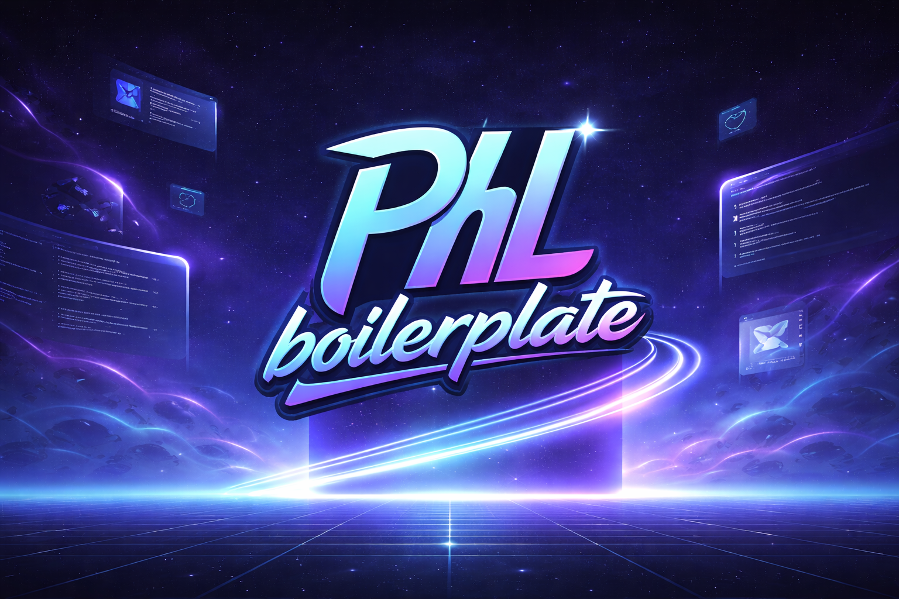

<p align="center">
  
</p>

# PHL RN Boilerplate

A modern, production-ready React Native boilerplate built with Expo SDK 54, MVVM architecture, and mobile development best practices.

## 🚀 Installation

### Using npx (Recommended)

```bash
npx create-expo-app my-app -t phl-rn-boilerplate
cd my-app
```

### Manual Clone

```bash
git clone https://github.com/pedrohbl03/phl-rn-boilerplate.git my-app
cd my-app
yarn install
```

## About

This template was created to accelerate React Native app development, providing a solid foundation with well-defined architecture, state management, internationalization, and modern styling.

**Package ID:** `com.phlstart.app`

## Tech Stack

| Technology | Version | Description |
|------------|---------|-------------|
| **Expo** | SDK 54 | React Native development framework |
| **React Native** | 0.81.5 | Cross-platform mobile framework |
| **TypeScript** | 5.9 | JavaScript with static typing |
| **Expo Router** | 6.x | File-based navigation |
| **NativeWind** | 4.x | Tailwind CSS for React Native |
| **Zustand** | 5.x | Global state management |
| **React Query** | 5.x | Server state management |
| **i18next** | 25.x | Internationalization |
| **MMKV** | 4.x | High-performance storage |
| **Zod** | 3.x | Schema validation |
| **React Hook Form** | 7.x | Form management |

## MVVM Architecture

The boilerplate implements the **Model-View-ViewModel (MVVM)** pattern, which clearly separates application responsibilities into three layers:

### Model

Represents the data and business logic of the application.

```
src/
├── domain/          # Entities and business rules
│   ├── entities/    # Domain types and interfaces
│   └── schemas/     # Validation schemas (Zod)
└── data/            # Data layer
    ├── api/         # HTTP client and interfaces
    └── storage/     # Local persistence (MMKV)
```

### View

The user interface. Pure React components that only render the UI and delegate actions to the ViewModel.

```
src/
├── app/                    # Routes (Expo Router)
│   └── (tabs)/             # Tab Navigator
└── presentation/
    └── screens/            # Application screens
        ├── HomeScreen.tsx
        ├── ArchScreen.tsx
        └── SettingsScreen.tsx
```

**View Characteristics:**
- Contains no business logic
- Receives formatted data from ViewModel
- Calls actions exposed by ViewModel
- Responsible only for rendering

### ViewModel

The bridge between Model and View. Contains presentation logic, manages screen state, and exposes data and actions to the View.

```
src/
└── presentation/
    └── viewmodels/
        ├── useHomeViewModel.ts
        ├── useArchViewModel.ts
        └── useSettingsViewModel.ts
```

**ViewModel Responsibilities:**
- Manage screen state
- Format data for display
- Expose actions that View can execute
- Abstract business logic from View

### Implementation Example

**ViewModel (`useSettingsViewModel.ts`):**
```typescript
export function useSettingsViewModel() {
  const { t, i18n } = useTranslation();
  const { isDark, toggleTheme } = useTheme();
  const { language, setLanguage } = useAppStore();

  // Data formatted for the View
  const title = t('settings.title');
  const themeValue = isDark ? t('settings.dark') : t('settings.light');

  // Available actions
  const handleToggleTheme = useCallback(() => {
    toggleTheme();
  }, [toggleTheme]);

  return {
    isDark,
    title,
    themeValue,
    handleToggleTheme,
    // ...
  };
}
```

**View (`SettingsScreen.tsx`):**
```typescript
export function SettingsScreen() {
  const vm = useSettingsViewModel();

  return (
    <SafeAreaView>
      <Text>{vm.title}</Text>
      <Switch value={vm.isDark} onValueChange={vm.handleToggleTheme} />
    </SafeAreaView>
  );
}
```

### MVVM Benefits

- **Separation of concerns**: More organized and maintainable code
- **Testability**: ViewModels can be tested independently of UI
- **Reusability**: Logic can be shared between different Views
- **Teamwork**: Developers can work in parallel on layers

## Folder Structure

```
src/
├── app/                    # Routes (Expo Router)
│   ├── _layout.tsx         # Root layout
│   └── (tabs)/             # Tab Navigator
│       ├── _layout.tsx     # Tabs layout
│       ├── index.tsx       # Home
│       ├── arch.tsx        # Architecture
│       └── settings.tsx    # Settings
│
├── components/             # Reusable components
│   └── ui/                 # Base UI components
│       ├── Button.tsx
│       ├── Card.tsx
│       ├── Input.tsx
│       └── Text.tsx
│
├── core/                   # Configuration and bootstrap
│   └── config/
│       ├── bootstrap.ts    # App initialization
│       └── env.ts          # Environment variables
│
├── data/                   # Data layer
│   ├── api/                # HTTP client (Axios)
│   └── storage/            # Local storage (MMKV)
│
├── domain/                 # Application domain
│   ├── entities/           # Entities/types
│   └── schemas/            # Zod schemas
│
├── hooks/                  # Custom hooks
│   ├── useApi.ts
│   └── useForm.ts
│
├── i18n/                   # Internationalization
│   ├── index.ts
│   └── locales/
│       ├── pt-BR.ts
│       └── en-US.ts
│
├── presentation/           # Presentation layer (MVVM)
│   ├── screens/            # Views
│   └── viewmodels/         # ViewModels
│
├── providers/              # Context Providers
│   ├── AppProvider.tsx
│   ├── ThemeProvider.tsx
│   └── query-client.ts
│
├── stores/                 # Global state (Zustand)
│   └── app.store.ts
│
├── styles/                 # Global styles
│   └── global.css
│
└── types/                  # Global types
    └── global.d.ts
```

## Setup

### Prerequisites

- Node.js 18+
- Yarn or npm
- Android Studio (for Android)
- Xcode (for iOS, macOS only)

### Installation

#### Using npx (Recommended)

```bash
npx create-expo-app my-app -t phl-rn-boilerplate
cd my-app
```

Then skip to step 4 (prebuild).

#### Manual Installation

1. Clone the repository:
```bash
git clone https://github.com/your-username/phl-rn-boilerplate.git
cd phl-rn-boilerplate
```

2. Install dependencies:
```bash
yarn install
# or
npm install
```

3. Configure environment variables:
```bash
cp .env.example .env
```

4. **Run prebuild** (see section below):
```bash
npx expo prebuild
```

5. Start the project:
```bash
# Development
yarn start

# Android
yarn android

# iOS
yarn ios
```

## Prebuild: Why is it necessary?

### What is Prebuild?

The `npx expo prebuild` (or `expo prebuild`) command generates the native `android/` and `ios/` folders of the project. This process is essential when using **Expo with native modules**.

### Why do we need Prebuild?

This boilerplate uses libraries that require native code:

| Library | Reason |
|---------|--------|
| **react-native-mmkv** | High-performance native storage |
| **react-native-reanimated** | Native animations |
| **react-native-gesture-handler** | Native gestures |
| **react-native-screens** | Optimized native navigation |

These libraries don't work with **Expo Go** (Expo's default development app) because they contain custom native code that needs to be compiled.

### Development Flow

```
┌─────────────────┐     ┌─────────────────┐     ┌─────────────────┐
│  expo prebuild  │ ──▶ │  Generates      │ ──▶ │  expo run:*     │
│                 │     │  android/ & ios/│     │  or yarn *      │
└─────────────────┘     └─────────────────┘     └─────────────────┘
```

### When to run Prebuild?

- **First time** cloning the project
- After adding a **new native library**
- After modifying `app.json` (name, icon, splash, etc.)
- After updating the **Expo SDK**

### Useful Commands

```bash
# Generate native folders
npx expo prebuild

# Clean and regenerate (useful after issues)
npx expo prebuild --clean

# Generate Android only
npx expo prebuild --platform android

# Generate iOS only
npx expo prebuild --platform ios
```

### Expo Go vs Development Build

| Expo Go | Development Build |
|---------|-------------------|
| Ready-to-download app | Custom build |
| Limited to Expo APIs | Supports any native library |
| No prebuild needed | Requires prebuild |
| Great for prototyping | Required for production |

This boilerplate uses **Development Build**, which offers full flexibility to use any native library.

## Included Features

- **Tab Navigator** with 3 screens (Home, Architecture, Settings)
- **Dark/Light Mode** with persistence
- **Internationalization** (Portuguese and English)
- **Persistence** of preferences in MMKV
- **Reusable UI Components** (Button, Card, Input, Text)
- **Configured HTTP Client** (Axios)
- **Form Validation** (Zod + React Hook Form)
- **Global State** (Zustand with persistence)
- **Server State** (React Query)

## Available Scripts

```bash
yarn start       # Start Metro Bundler
yarn android     # Run on Android
yarn ios         # Run on iOS
yarn web         # Run in browser
```

## Customization

### Change Package ID

1. Update `app.json`:
```json
{
  "expo": {
    "ios": {
      "bundleIdentifier": "com.yourdomain.app"
    },
    "android": {
      "package": "com.yourdomain.app"
    }
  }
}
```

2. Run prebuild:
```bash
npx expo prebuild --clean
```

### Add New Language

1. Create translation file in `src/i18n/locales/`
2. Import and register in `src/i18n/index.ts`
3. Add option in `useSettingsViewModel.ts`

### Create New Screen (MVVM)

1. Create ViewModel in `src/presentation/viewmodels/`
2. Create Screen in `src/presentation/screens/`
3. Create route in `src/app/`
4. Export in `index.ts` files

## License

MIT

---

Developed with ❤️ by PhL
